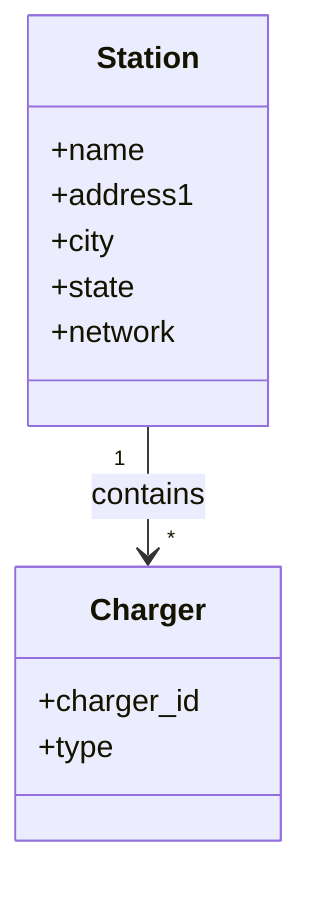

# Charging Station Grouping

## Problem

A **charging station** is a site where EV drivers can charge, and can have one or more individual chargers (similar to how a gas station has one or more pumps).

When we query a nearby charging stations API, the response can be inconsistent across networks: some providers return one station per physical location with multiple chargers nested under it, while others return one station per charger. For example, we might see one EVGo station at "111 Main St" with two chargers ("Hall" and "Oates") under it—one pin on the map—while Chargepoint returns separate station records for each charger at "3805 Moto St" and "555 Broadway." That results in a bad user experience: multiple pins at the same address instead of a single station with multiple chargers.

**Goal:** Group stations that share the same address and network into a single station with all chargers nested under it, so the map shows one pin per location (per network) with multiple chargers, consistent with the better UX.

**Model A: One station per charger** (multiple pins at same address)


**Model B: One station per location** (one pin, many chargers) ⬅️ Preferred model




```topojson
{
  "type": "Topology",
  "transform": {
    "scale": [1, 1],
    "translate": [0, 0]
  },
  "objects": {
    "stations": {
      "type": "GeometryCollection",
      "geometries": [
        {
          "type": "Point",
          "properties": {"address": "3805 Moto St", "station_name": "Moto-1", "network": "Chargestop"},
          "coordinates": [19.9451, 50.060]
        },
        {
          "type": "Point",
          "properties": {"address": "3805 Moto St", "station_name": "Moto-2", "network": "Chargestop"},
          "coordinates": [19.9452, 50.060]
        },
        {
          "type": "Point",
          "properties": {"address": "3805 Moto St", "station_name": "Moto-3", "network": "Chargestop"},
          "coordinates": [19.9453, 50.060]
        },
        {
          "type": "Point",
          "properties": {"address": "555 Broadway", "station_name": "Broadway", "network": "Chargego", "marker-color": "#22c55e"},
          "coordinates": [19.948, 50.058]
        }
      ]
    }
  },
  "arcs": []
}
```

## What this repo does

This repository implements a transformation from Model A to Model B. It defines a function that takes the array of stations and returns a new array with stations merged by address and network, so each location appears as one station with multiple chargers.

Run the example:

```bash
go run main.go
```

The program uses sample data that mirrors the scenario above (e.g. multiple Chargestop stations at the same address, one Chargego station with two chargers) and prints the grouped result as JSON.
